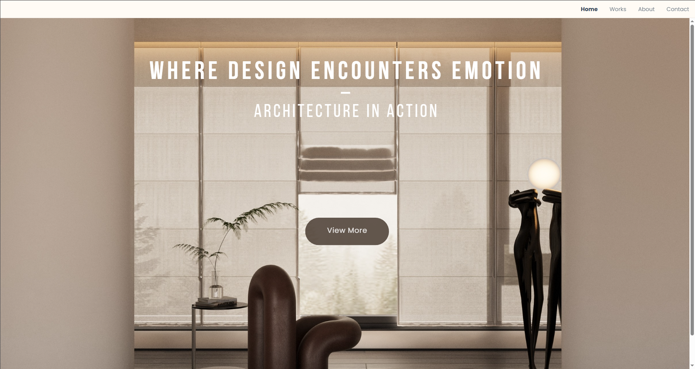
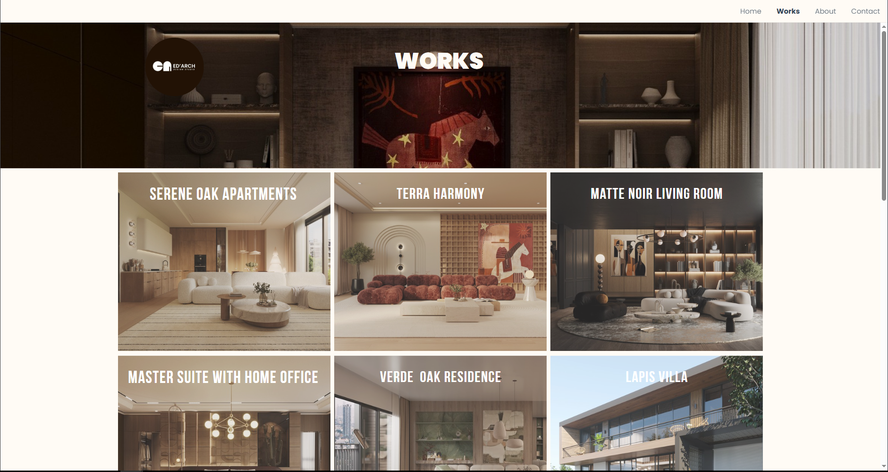
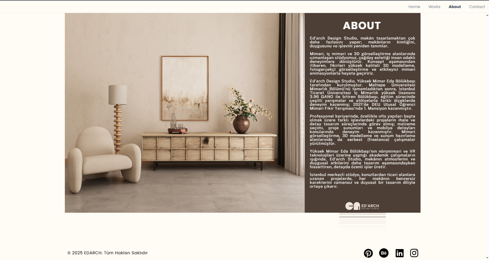
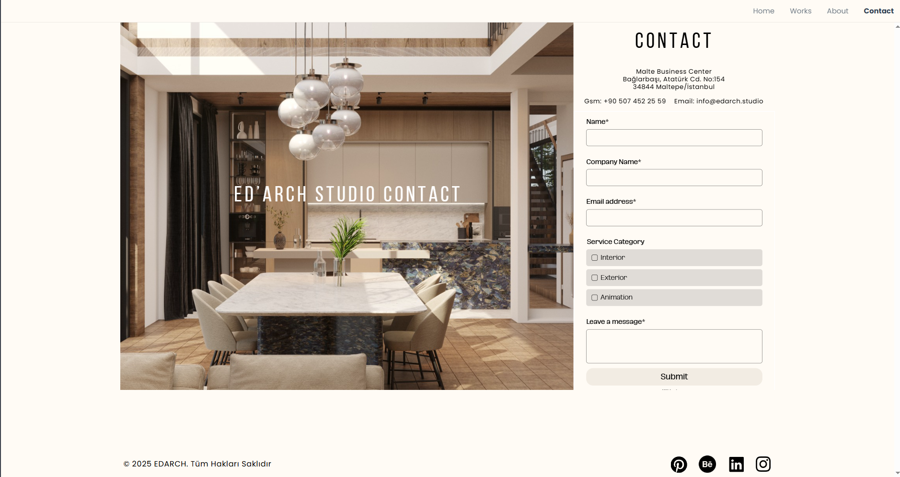

  
  

    

  <h1 style="font-family: 'Helvetica', sans-serif; letter-spacing: 2px; text-transform: uppercase;">
    EDARCH STUDIO
  </h1>
  

    Corporate Architecture & Design Portfolio
  

   

  

 
 

<h3>🚀 Project Overview</h3>

  A high-end corporate website designed and deployed for <strong>Edarch Studio</strong>, an architectural firm based in Istanbul. The project focuses on visual hierarchy, minimalist aesthetics, and showcasing architectural renders with high fidelity.

 

<h3>💡 Engineering Decision: The "No-Code" Strategy</h3>

  As a software developer, my goal is to provide the <strong>most efficient solution</strong> for the client's specific needs.

<blockquote>
  <strong>The Client Requirement:</strong> 
  <em>"We need a portfolio that matches our visual identity, loads fast, and most importantly, allows us to change text and project images instantly without needing a developer."</em>
</blockquote>

<strong>The Solution:</strong> 
Instead of building a custom CMS with a high learning curve, I architected a <strong>No-Code solution using Canva Web Publishing</strong>.

 

<h3>📸 Project Gallery (Click to Visit Pages)</h3>

<table width="100%">
  <tr>
    <td width="50%" valign="top" align="center">
      <h4>1. Project Showcase (Works)</h4>
      
      
<em>Click image to view Works</em>

    </td>
    <td width="50%" valign="top" align="center">
      <h4>2. Corporate Identity (About)</h4>
      
      
<em>Click image to view About</em>

    </td>
  </tr>
  <tr>
    <td colspan="2" align="center">
      <h4>3. Lead Generation (Contact)</h4>
      
      
<em>Click image to view Contact Page</em>

    </td>
  </tr>
</table>

 
 

<h3>🛠️ Tools & Technologies</h3>
<ul>
    <li><strong>Platform:</strong> Canva (Web Publishing)</li>
    <li><strong>Hosting & DNS:</strong> Canva Managed</li>
    <li><strong>Domain Strategy:</strong> Custom Domain Integration & SSL (Secure Connection)</li>
</ul>

 

  <h3>👤 Author</h3>
  

    <strong>Arda Bölükbaşı</strong> 
    <em>Software Developer & Technical Consultant</em>
  

  

